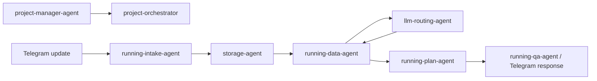

# Agent Training Status

Date: 2026-05-13

Training here means project-local operational training: each logical agent gets
clear inputs, outputs, boundaries, handoff rules, and current implementation
links. It is not model fine-tuning.

## Current Batch

| Agent | Status | What It Knows Now | Next Training Step |
|---|---|---|---|
| `project-manager-agent` | trained | Current stage, roadmap, blockers, next task selection, dashboard status, `find-skills` discovery results | Keep `docs/project-management.md` and dashboard status current after each meaningful change |
| `storage-agent` | trained | Safe project-root IO, atomic JSON writes, raw file naming, relative paths, `systematic-debugging` candidate | Add boundary tests |
| `running-intake-agent` | trained | Commands, workout photos, caption date hints, deterministic post-workout feedback | Add unit samples |
| `running-data-agent` | trained | Raw saving, SHA-256 duplicate detection, parsed.json, vision extraction handoff, `systematic-debugging` candidate | Add multiple workouts per day policy |
| `llm-routing-agent` | trained | OpenAI-compatible env config, Qwen vision, timeout/error boundary, `systematic-debugging` candidate | Add retry and cost policy |
| `running-plan-agent` | training | History aggregation, half-marathon report, current plan JSON, feedback notes in `/today` and `/week` | Add automatic plan rewrite |
| `dashboard-agent` | training | Roadmap, agent cards, KPI, pipeline, responsibility matrix, `web-design-guidelines` and `webapp-testing` candidates | Add live status from event log |
| `running-qa-agent` | planned | Prompt exists, needs compact context builder | Build `/ask` or text QA flow |
| `nutrition-data-agent` | planned | Preferences exist, meal schema exists | Start after running MVP stabilizes |

## External Skill Map

External skills discovered through `find-skills` are mapped in
`docs/skills-training-map.md`. They are assigned as operating instructions, not
as fine-tuned model weights.

Installed local skills:

- `.agents/skills/find-skills`
- `.agents/skills/systematic-debugging`
- `.agents/skills/web-design-guidelines`
- `.agents/skills/webapp-testing`
- `.agents/skills/skill-creator`

`project-manager-agent` is trained with the installed `find-skills` workflow. A
dedicated third-party PM skill was not installed because the discovered
project-management and roadmap candidates did not meet the preferred trust
threshold.

## Working Pipeline

## Training Rules

- Every agent must own a narrow responsibility.
- Every agent must name what it does not do.
- File writes stay inside the project root.
- Raw images are sent to vision only when extraction is needed.
- Unknown workout values remain `null`.
- User-facing Telegram answers stay short.
- Medical or injury symptoms require conservative safety language.

## Next Batch

1. Add unit samples for `running-intake-agent` feedback:
   `сделал`, `тяжело`, `легко`, `перенёс`, `пропустил`, `пульс высокий`.
2. Train `running-plan-agent` to rewrite the next 1-3 days from that feedback.
3. Train `running-qa-agent` to answer normal running questions with compact context.
